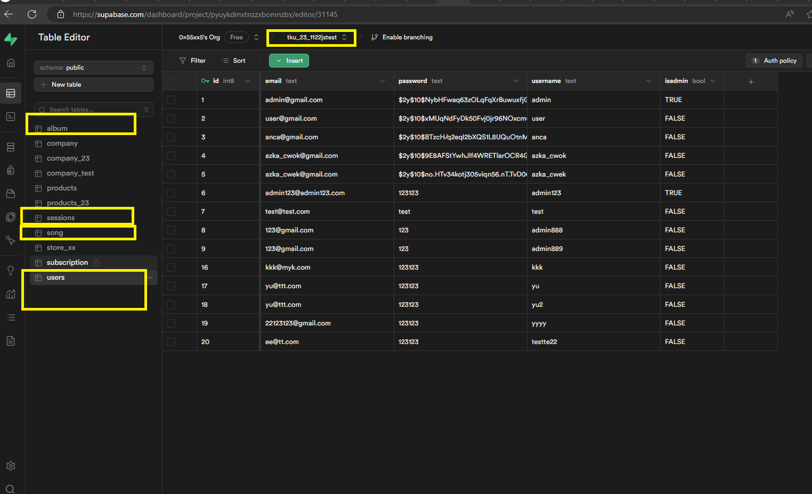
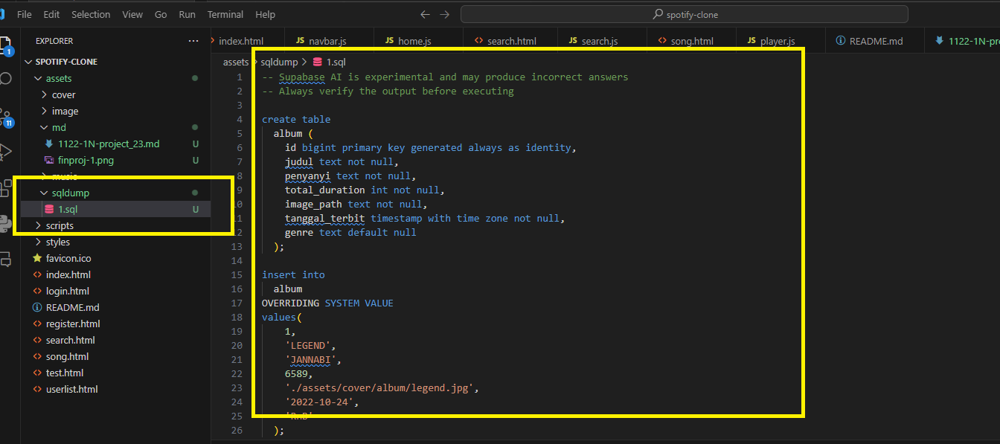

# 專案目標

模仿spotify 來做一個網頁音樂播放站點
需要會員制登入才可以進行播放
站點名稱為Kpotify

非會訂閱會員只能無限暢聽為了演示用 暫時訂24H 、
訂閱會員則沒有限制

# user story 
使用者需要註冊 進入播放列表
可以搜尋自己喜歡的音樂
註冊後可以無限次播放音樂期限24小時
時間到期後需要升級訂閱會員才能繼續使用服務，本次專案不涉及訂閱功能，所以註冊用戶與功能測試請在註冊後24h完成，或重新註冊繼續使用功能完成評分

## 專案託管在vercel.com
## 資料庫supabase
## 前端html js css
## 後端 svelte server api

# 架構
前後端分離
走restful api 交互

# 資料庫結構
共有4 張表格 見sql script dump

# 註冊
寫入user表
取回session交互用的認證字串
註冊後登入歌曲列表頁面

# 登入
使用api進行token取得存入一組自己定義的加密字串 ,我使用base64進行加密存在
cookie後 每次請求都會帶上，作為後續身分驗證使用

登入時服務端 寫入session 到資料表

# 使用者功能
獲取所有專輯列表
搜尋功能 關鍵字 與專輯風格類型進行搜尋 使用sql like

# 專輯對應相關歌曲
歌曲可以進行試聽 mp3’格式 使用html5內建tag播放
在畫面上選取相關歌曲後進行play icon點選後即可播放

# sql關聯表使用
 ## join
### user and session table

專輯
歌曲
### album and song table

# 身分驗證
服務端驗證授權功能來自服務端hook.server.js代碼 （引用說明見參考資料）
只要cookie裡面加密的字串過期或者cookie 失效 便判斷為登出 需要重新登入才能正常運作
可以用f12查看cookie

# 困難點
## sql to api 要查看官方的文件 以便能夠順利使用標準sql的功能 比如 like 、等於、join等等

##  cors  前後端分離後 會有跨域問題 
 已在hook serve js解決 請見我提供的原始程式
 
## 部署vercel 失敗。需要在vercel改成node 18 ,vercel暫時不支援node20以上

# 甘苦談
由於老師暫時沒有說到如何開放自己的api
因為需要服務器
我又不想使用純node express 來當服務器也不想使用其它後端語言進行服務端搭建

聽聞老師的介紹next .js功能後 ，查詢資料後發現可以使用前端框架跟next nuxt類似的框架
svelte,也很受到相關開發人員歡迎

由於但老師應該會在課堂上使用nuxt next 
所以我選擇相關類似的框架svelte 、額外學習
但 礙於時間有限 其功能開發有限 已在開頭與最後結尾說明

 svelte具有路由功能 官方文件也有介紹部署到vercel  功能
 可以作為解決方案
 經過簡單的hello world 
 與get product 
 的測試後
 確認可行性，便著手閱讀官方文件與查詢相關使用方式
  

# 後續擴展功能

訂閱功能 要升級訂閱才能無限制播放
超級管理員管理專輯的功能 可以增加專輯與歌曲

# 參考資料
這邊改自開源專案
後端我已經全部替換為svelte api
原本參考的專案使用php 並且使用mysql也沒有做前後端分離

所以我的主要目標

是魔改 成前後端分離 

使用新框架svelte 跟supabase作為服務
資料交互採取api
部分邏輯些在服務端,以及服務端組成所需資料後回傳給前端

前端只有單純的js. html css
css同時也改成sass 編譯
js網路傳輸部分。全部改成fetch函數

這些是我魔改後最大的差異

跟原本參考專案已經相差甚遠

# 後續技術優化目標

1. supa base回來的 model 沒有強類型
在ts裡頭很難去直接使用properties 
在業務轉換時容易typo 拼錯造成意外
官方有提供typescript 的支援可以針對model 變成強類型

礙於工作繁忙 沒有額外時間去研究
等工作之餘再行研究

2. 手機版或移動端版本 可以再優化排版

3. 增加訂閱功能 、 目前沒有實作訂閱功能 ，只能試聽24h為了演示用
 
4. 登入的部分可以改jwt 來實作

另外 礙於時間開發
如果使用上有遇到障礙
請直接teams與我聯繫
我將用秒速的方式來解除障礙
或者透過訊息回饋給我

# 參考資料與說明

